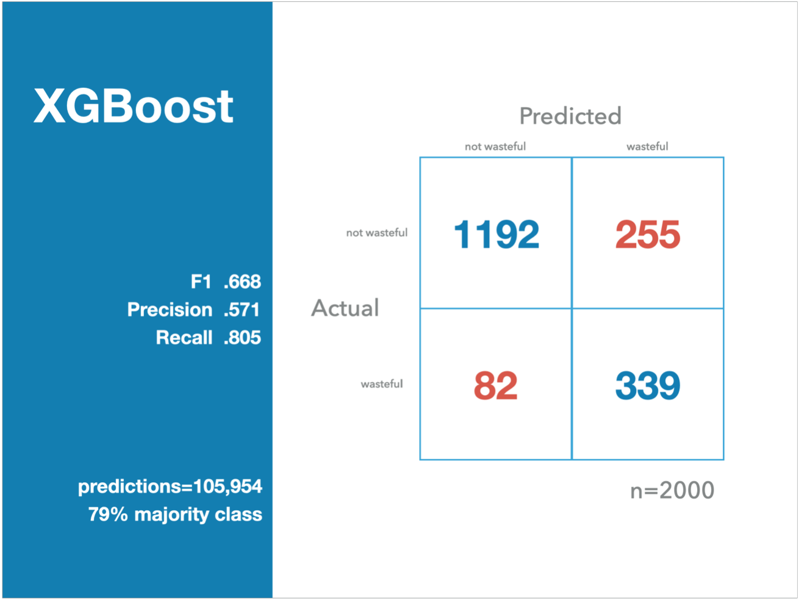

# Identifying Wasteful 311 Requests in San Francisco

#### What is 311?
3-1-1 is an easy-to-remember telephone number that connects people with service representatives who route people to non-emergency City and County of San Francisco government matters.

#### Why 311?
With over 2,300 different telephone numbers listed to access local government services, many people did not know what number to dial to reach the appropriate department. Before 311, over 50% of calls to the 911 center were not emergency related. 311 relieves 911 operators from these non-emergency calls. 

#### Problem Statement
311 captures requests for service from the public, and the public is unaware if the issue they see has already been reported. Often times a single incident generates multiple requests while some incidents do not generate any requests. There are also cases where service agents respond to an incident on-site, to find that the issue has already been resolved or worse, nothing is found.

Wasteful requests account for about 25% of all requests and identifying them will help reduce the queue for over 100 agencies that respond to these requests.

## What is wasteful?
* Requests for the same issue 
* Invalid requests or not enough information
* Nothing is found once an agency responds to a request on site

Here are some keywords extracted from the incident status notes which I used to create the target to label `wasteful` requests:

#### Data
[DataSF](https://data.sfgov.org/City-Infrastructure/311-Cases/vw6y-z8j6 "DataSF 311 Cases") provides requests created since 7/1/2008 as a CSV as well as through the Socrata Open Data API (SODA). 

Shape of data:
* Rows: 4.1M (each row is a 311 case)
* Columns: 20

| Column              | Description                                                                                                                                                       |  Type       |
|---------------------|-------------------------------------------------------------------------------------------------------------------------------------------------------------------|-------------|
| CaseID              | The unique ID of the service request created.                                                                                                                     | Number      |
| Opened              | The date and time when the service request was made                                                                                                               | Date & Time |
| Closed              | The date and time when the service request was closed                                                                                                             | Date & Time |
| Updated             | The date and time when the service request was last modified. For requests with status=closed, this will be the date the request was closed                       | Date & Time |
| Status              | A single-word indicator of the current state of the service request. (Note: GeoReport V2 only permits ‘open’ and ‘closed’)                                        | Plain Text  |
| Status Notes        | Explanation of why status was changed to current state or more details on current status than conveyed with status alone                                          | Plain Text  |
| Responsible Agency  | The agency responsible for fulfilling or otherwise addressing the service request.                                                                                | Plain Text  |
| Category            | The human readable name of the service request type                                                                                                               | Plain Text  |
| Request Type        | The human readable name of the service request subtype                                                                                                            | Plain Text  |
| Request Details     | The human readable name of the service request details                                                                                                            | Plain Text  |
| Address             | Human readable address or description of location                                                                                                                 | Plain Text  |
| Street              | Primary Street of the associated address. Parks may have a park name instead of a street name. Requests not associated with an address will be blank.             | Plain Text  |
| Supervisor District | San Francisco Supervisor District as defined in 'Supervisor Districts as of April 2012'                                                                           | Number      |
| Neighborhood        | San Francisco Neighborhood as defined in 'SF Find Neighborhoods'                                                                                                  | Plain Text  |
| Police District     | San Francisco Police District as defined in 'Current Police Districts'                                                                                            | Plain Text  |
| Latitude            | Latitude of the location, using the WGS84 projection                                                                                                              | Number      |
| Longitude           | Longitude of the location, using the WGS84 projection                                                                                                             | Number      |
| Point               | Combination of Latitude and Longitude for Socrata native maps                                                                                                     | Location    |
| Source              | Mechanism or path by which the service request was received; typically ‘Phone’, ‘Text/SMS’, ‘Website’, ‘Mobile App’, ‘Twitter’, etc but terms may vary by system. | Plain Text  |
| Media URL           | A URL to media associated with the request, e.g. an image.                                                                                                        | Website URL |

## Quick Insight
The top 4 request types, made up about two-thirds of all requests – 64%. More importantly, parking and encampment requests have high rates of “wastefulness”.

## Classifier Results
To better interpret over 105k predictions of the model, I used a confusion matrix which I normalized to represent the mean number of requests per day – 2000.

On any given day, the model can accurately predict about 339 wasteful requests. Although 255 would be considered false positives, these aren’t as alarming because it’s likely that SF311 and public agencies don’t report all “wasteful” requests. It’s likely that the model is doing better than advertised.

